# TeleDoc - A Doctor Appointment System

## Description

Teledoc is a web-based application designed to facilitate the scheduling of appointments between patients and doctors. It provides a platform for patients to search for doctors based on various criteria such as specialization, location, and availability, and book appointments with them online. The system also enables doctors to manage their appointment schedules and interact with patients efficiently.

## Languages and Technologies Used

- **PHP:** Hypertext Preprocessor (PHP) is used for backend development, handling server-side logic, and interacting with the MySQL database.
- **MySQL:** MySQL is utilized as the relational database management system (RDBMS) for storing and managing data related to patients, doctors, appointments, and other system entities.
- **HTML/CSS:** HyperText Markup Language (HTML) and Cascading Style Sheets (CSS) are employed for frontend development, defining the structure and styling of the web application.
- **JavaScript:** JavaScript may be used to add interactivity and dynamic functionality to the user interface, enhancing the user experience.

## Functionalities

- **User Authentication:** Patients, doctors, and admin users can register and login securely to access the system.
- **Doctor Search:** Patients can search for doctors based on specialization, location, and availability.
- **Appointment Booking:** Patients can book appointments with doctors, specifying the date, time, and reason for the appointment.
- **Appointment Management:** Doctors can view and manage their appointment schedules, including accepting, rejecting, or rescheduling appointments.
- **Admin Panel:** Admin users have access to an administrative panel to manage user accounts, doctor profiles, and system settings.

## Screenshots

### User

#### Home Page

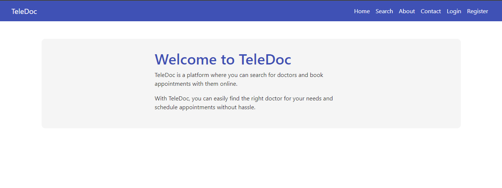

#### Login

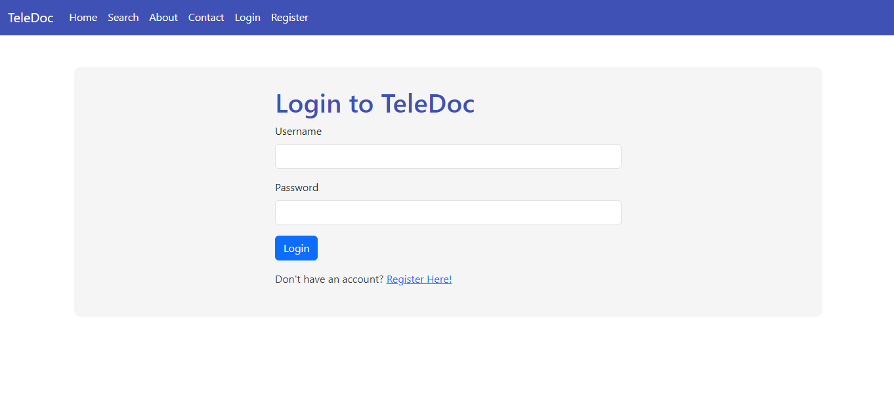

#### Register

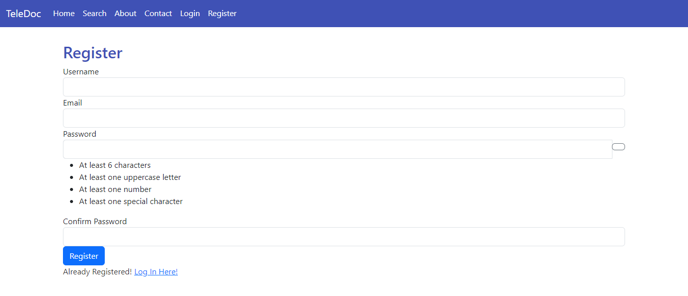

#### Doctor Search

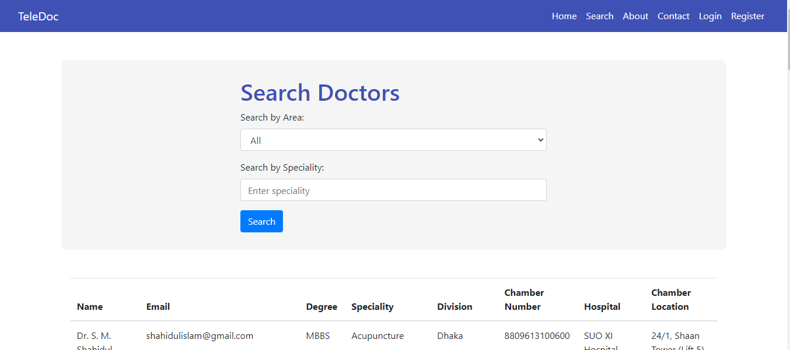

#### Appointment Booking


#### User Profile

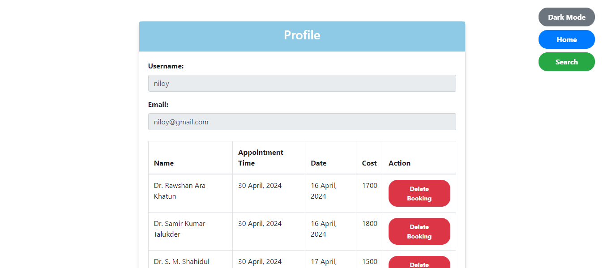

#### Contact

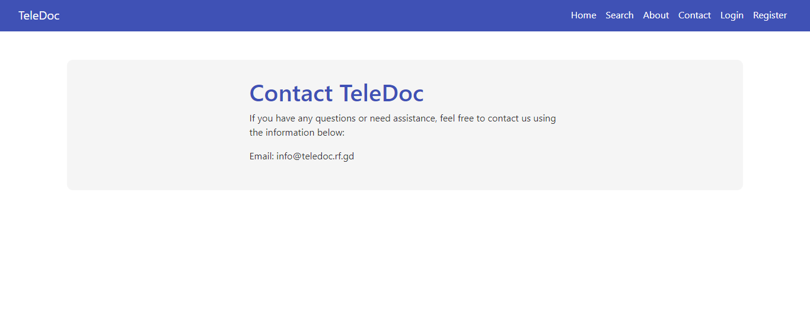

#### About

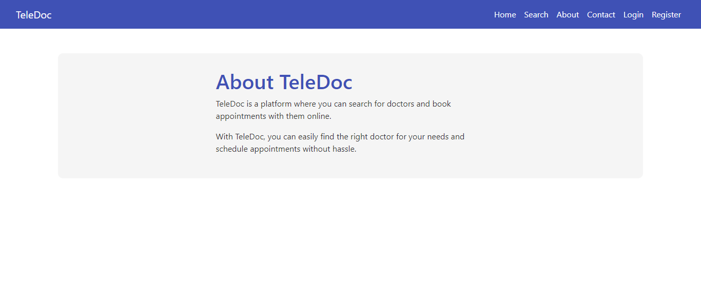

### Doctor Panel

#### Login

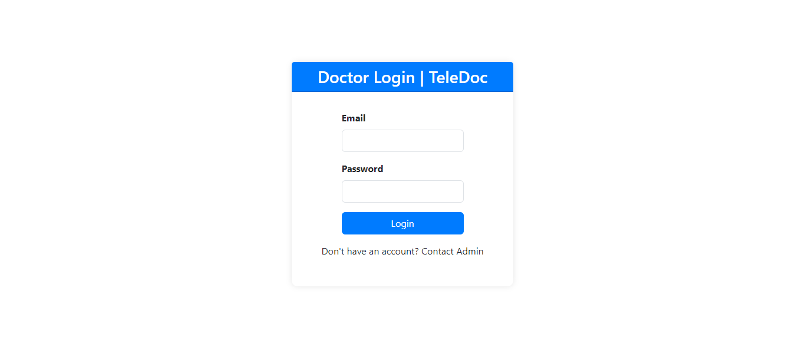

#### Profile

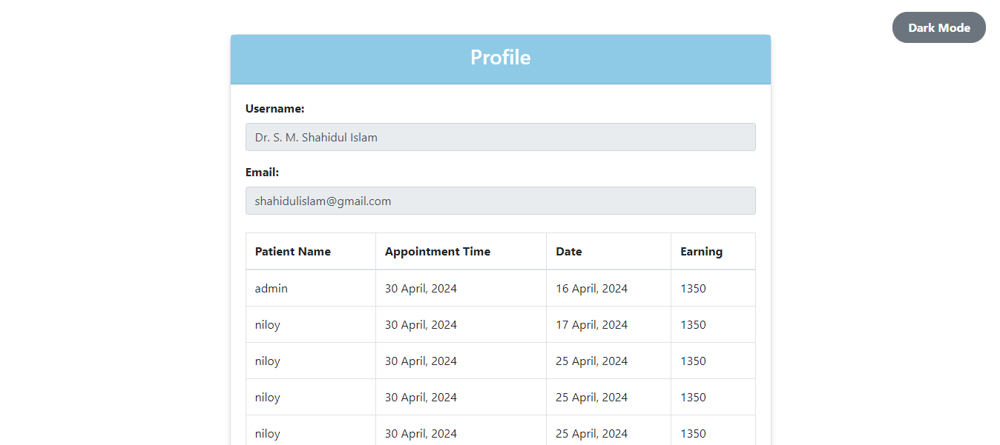

### Admin Panel

#### Login


#### Add Doctor

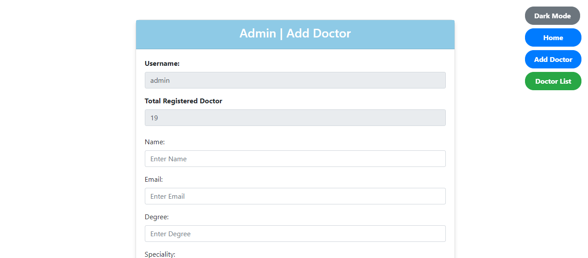

#### Manage Doctor

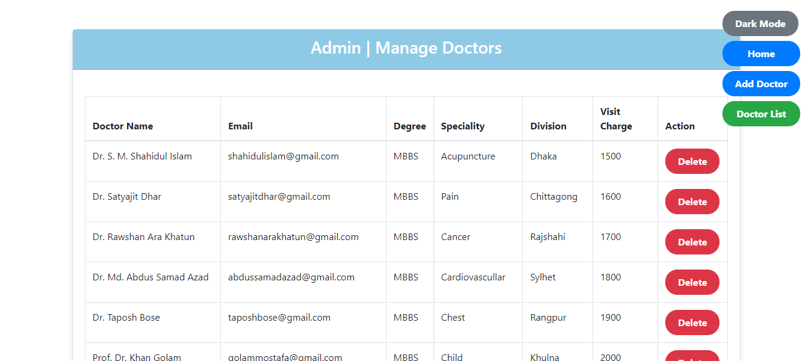

## Setup Instructions (Using XAMPP)

1. **Download and Install XAMPP**

   - Download XAMPP from the [official website](https://www.apachefriends.org/index.html) and follow the installation instructions.

2. **Start Apache and MySQL Servers**

   - Open the XAMPP Control Panel and start the Apache and MySQL servers.

3. **Clone the Repository**
   ```bash
   git clone https://github.com/zenjahid/TeleDoc.git
   ```
4. **Move the Project Files**

   - Move the cloned project directory to the `htdocs` directory inside the XAMPP installation directory.

5. **Import Database**

   - Open phpMyAdmin, create a new database named `teledoc`, and import the SQL file (`teledoc.sql`) provided in the project's `database` directory.

6. **Configure Database Connection**
   - Open the `connection.php` file to update the database connection details as per your XAMPP configuration.
